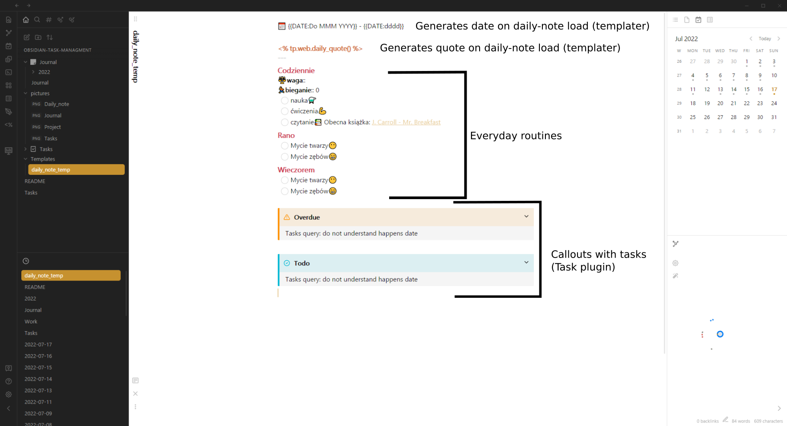

# obsidian-task-managment

Example vault with task managment system under Obsidian 

## Instalation

Use the following plugins: 

[Dataview](https://github.com/blacksmithgu/obsidian-dataview)                   <- for quering notes (used by other plugins)

[Templater](https://github.com/SilentVoid13/Templater)                 <- for templates

[Tasks](https://github.com/obsidian-tasks-group/obsidian-tasks)                         <- for task quering

[Heatmap Calendar](https://github.com/Richardsl/heatmap-calendar-obsidian)   <- for heatmap indicator in journal file

[Charts](https://github.com/phibr0/obsidian-charts)                       <- for charts in journal file

[Periodic Notes](https://github.com/liamcain/obsidian-periodic-notes)          <- (optional) for daily notes

[Kanban](https://github.com/mgmeyers/obsidian-kanban)                     <- (optional) for kanban board

[Icon Folder](https://github.com/FlorianWoelki/obsidian-icon-folder)               <- (optional) for icon folders

[Minimal Theme](https://github.com/kepano/obsidian-minimal-settings)        <- the sample vault use this theme

## Usage

### Tasks
The main file for tasks. The inbox is included and you can put all your tasks here if they are not designated for any project. Links to folders (projects) also can be included to help with navigation 

Example of project note

You can use also kanban boards. Unfortunately the date format from [Kanban](https://github.com/mgmeyers/obsidian-kanban) plugin is not compatible with [Tasks](https://github.com/obsidian-tasks-group/obsidian-tasks) plugin so I just add the date by hand. 

### Daily notes
Each daily note is like "Today" view in every to-do app. The idea is as follows:
- each daily routine put into daily-note template
- any other task with due-date or schedule date are visible within callouts with [Tasks](https://github.com/obsidian-tasks-group/obsidian-tasks) plugin queries

Example how daily note looks like for specific date

### Journal
If you like summarizing your habits or routines here you can add charts. They soak data from daily notes with [Dataview](https://github.com/blacksmithgu/obsidian-dataview) plugin and then using [Heatmap Calendar](https://github.com/Richardsl/heatmap-calendar-obsidian) and [Charts](https://github.com/phibr0/obsidian-charts) create such pictures live.

